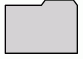
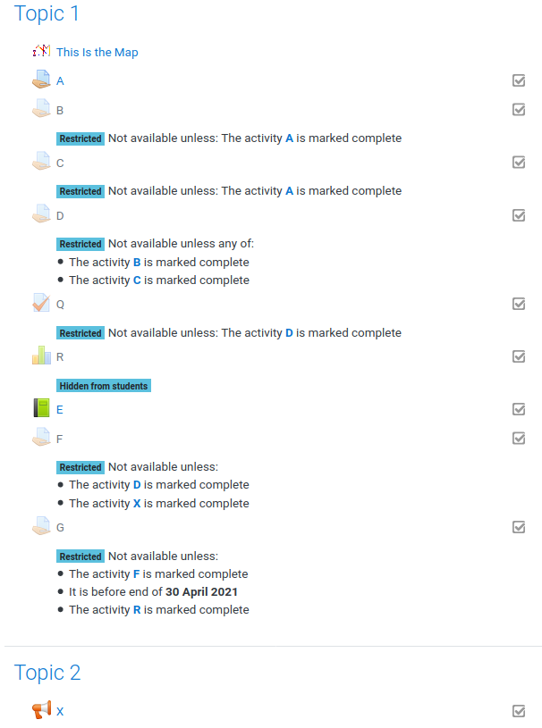

# moodle-mod_activitymap

This module allows teachers to vizualize dependencies between moodle activities in a interactive graph. 

## Purpose
An activitymap is an automatically generated graph which visualizes the dependencies between activities that arise due to completion restrictions.

It can be used give the students a clue about the different activities and in which order they have to be completed to reach a certain goal. In this terms it is a very versatile tool for individualization and helps to improve the ability of the participants to choose their own learning path through a course.

## Usage

### Creating a graph

We have good news for you - you do not need to draw or create a graph by your own; It is automatically generated by the activities within your course - as long as you have enabled completion tracking within your course.

As you surely know, activities like Assignments, Pages, URLs, ...  can have (nested) restrictions under which circumstances the activity is enabled. If the restricion is of the type _Required completion Status_ then we draw a directed edge to the current activity from the activity which is required to be completed. 

If there are no restrictions, then we only draw the activity boxes - without any edges between them.

We have tried to display the same things in the graph, as you would display in your course. If you add a description to an activity or an a section (and the description is shown on the course page) then it will also be shown in the graph. for security reasons we only display the plain text with a few HTML attributes (`<strong>`, `<em>`, `<u>`, `<del>`, ``, ``). All other elements are stripped.

The font color of the nodes is representing the completion state:

* grey: This activity is not available for the user because the preconditions have not been fulfilled. 
* black: This activity can be processed.

additionally there can be three symbols beside a node:

* green checkmark: The activity has been (sucessfully) completed.
* red cross: The activity has been completed, but the student failed.
* edit symbol: Appears only if you have the permission to edit this activity, and brings you directly to the edit page when clicked.

### Module Settings

The default settings allow the user to create an overview about the whole course dependencies, grouped by the sections where the activities are appearing in. If you want to change this behaviour or the appearence of the graph then you have the following options:

#### Graph direction
The main-direction of the graph can be either `Top -> Down` or `Left -> Right` (or the other way around) and influences the visual appearence of the graph. If `Top -> Down` is selected then the graph is laid out from top to bottom - meaning that the directed edges tend to go from top to bottom. 

#### Section background color
It is possible to group the activity nodes by their section they appear in. This option defines the background color for this grouping. If you choose `Random`, then every block will have a distinct color - but blocks with the same name will have the same color. The option `Transparent` indicates that the node should not have any color at all.

| Name          | Color                                     |
| ------------- | ----------------------------------------- |
| Aliceblue     |            |
| Ghostwhite    |          |
| Beige         |                    |
| Lightgrey     |            |
| Lightpink     |            |
| Lightyellow   |        |
| Palegreen     |            |

#### Element shape
The activities can appear in different shapes. Here you can define which shape should be used.

| Name          | Shape                                     |
| ------------- | ----------------------------------------- |
| Box           |                        |
| Ellipse       |                |
| Diamond       |                |
| Parallelogram |    |
| Star          |                      |
| Note          |                      |
| Tab           |                        |
| Folder        |                  |

#### Edge type
The arrows between the activities (=edges) can appear in different shapes. Here you can define which shape should be used.

#### Node seperation
This setting defines the minimum space between two adjacent nodes. If you think that the nodes are too close to each other then try to play with this setting by increasing it to get more space between the nodes.

#### Content 

This setting defines what content of the course should be queried to calculate the graph. There are three different settings available:

* `All sections` draws a graph where all activities of all sections are rendered into a single graph. 
* `All sections grouped` draws also a graph with all activities - but it groups them togehter into their sections. The background color can be modified by the _Section background color_ setting.
* `Current section` draws a graph which shows only the activities within the section where the activitymap is placed and its direct dependencies. If there are references from outside the current section, then these nodes will be elipse-shaped with a grey font have a dotted border. The color of this outside nodes does have nothing to do with their completion status.

### Frequently Asked Questions

#### Can I provide more information about an activity in the graph ?
Yes. Just place the additional information for the activity in the _Description_ field of the activity and check the _Display description on course page_ option.
  
#### Can I provide more information about a section in the graph ?
Yes. Just place the additional information for the section in the _Description_ field of the activity and check the _Display description on course page_ option. If you want to emphasize on something then you can also use.

#### How can I exclude things from the graph ?
We only display activities which have some sort of completion tracking. So if you want to exclude something from the graph set the _Completion tracking_ option to the value _Do not indicate activity completion_.

#### Why does 'hide from students' not hide the nodes within the graph ?
Hidden activities can also serve as a condition to complete another activity. So it makes sense that even hidden activities are rendered. But in order to hide information from the students, hidden activities are rendered only as a small dot, and they do not provide additional information about the hidden activity.

#### Is it possible to show the graph directly in the course page ?
Yes. If the checkmark _Display description on course page_ is set, and you have NOT entered any description then the plugin assumes that you want to have the graph displayed directly on the course page. This works fine for small to medium sized graphs, but if you have (in terms of area) huge graphs with grouped activities then you meight expierience correct but strange looking results. 

#### Can I embed such a graph within a label ?
Yes - just place an `<iframe>` tag that references the activitymap. By appending the parameter `plain=1` you will get the pure graph - without the moodle headers and footers. Be sure to set the completion of these labels containing the iframe to _Do not indicate activity completion_. Otherwise this will result in an undefined behavior.

Here an example how to display only the static image of the graph `https://my.moodle.com/moodle/mod/activitymap/view.php?id=47&plain=1`
The usecase behind this is, to be ble to get a printable version of the graph.

Of course you can use it within an iframe within a label - in order to display the current section. This snipplet gives you only a static image (with no zooming and links to activities). 

~~~~~
<iframe src="../mod/activitymap/view.php?id=399&plain=1" seamless="" width="600" height="1000"></iframe>
~~~~~

If you want to have a clickable graph then you can use the `lightweight=1` parameter. This generates a clickable graph with links, but without the moodle headers and footers.

~~~~~
<iframe src="../mod/activitymap/view.php?id=399&lightweight=1" seamless="" width="600" height="1000"></iframe>
~~~~~

#### Is it possible to assign different node shapes for different activities ?
No. All nodes will always have the same style.  

#### Which activity restricions are beeing processed ?
We only process the _Activity completion_ and the _Date_ restricion. Other restrictions are neither processed nor visualized.

#### There are some nodes with a different style. What do they mean ?

Lets have a look at the following example:

| The moodle course structure          |  Content of activitymap                            |
| ------------------------------------ | ------------------------------------------------ |
|  |  |

The activitymap should only display the content of the current section.

The plugin creates multiple types of nodes:

Activity nodes 
: The box nodes {`A`, `B`, `C`, `D`, `E`, `F`, `G`, `Q`, `X`} are derived from the activities. These nodes are basically nodes with any type of activity completion. The description is only rendered if the description should be displayed on the course page. The node `A` and the node `E` do not have any incoming dependencies (edges) and can be taken at any time. 

Hidden nodes
: The node `R` is an activity node which is hidden from the students. Hidden nodes are (in contrast to nodes without activity completion) still rendered within the graph, but there are no details shown.

Condition nodes
: These are the round nodes in the graph. If all conditions have to be met then a `&` node will be generated, if one condition is enough then a `>=1` node is generated. For example: Activity `D` can be taken if either `C` OR `D` is marked as completed. And the activity `F` can be taken if `D` AND `X` are marked as completed.

Unreachable nodes
: The node `X` is a so called _unreachable node_. Remember: This graph shows only the content of the Section _Topic 1_. `X` is required to work on activity `F` - and since it is located out of display scope (it is not in Topic 1) it is rendered as dotted elipse. 

Date nodes
: The hexagonal shape at the right of the graph represents a date node. These nodes are representing a point in time which is linked as condition for a activity. In the upper example the activity `G` can only be taken if `F` is marked as complete AND if the current time is before Thuesday the 1st Dec. 2020. This also means that `F` can not be taken after that point in time. 

## Authors

* [Günther Hutter](https://github.com/bytebang) (guenther.hutter@htl-leoben.at)
* [Andreas Pötscher](https://github.com/AndreasPoetscher) (andreas.poetscher@htl-leoben.at)

We are two teachers (and former software developers) which have developed this plugin in order to organize our LAB sessions at the department for IT & Smart Production at the [HTL Leoben](https://www.htl-leoben.at). We are using it for our own lessons and currently it fits our needs perfectly.

## Development

We use this [GitHub Repository](https://github.com/bytebang/moodle-mod_activitymap) as SCM location for the main development branch. If you have any [issues or questions](https://github.com/bytebang/moodle-mod_activitymap/issues) let us know about them, by using the github integrated bugtracker. 

If you want to participate in the development then just fork the code, implement your (well documented) enahncements and send us a pull request. If you are not a developer, but still want to participate then you have the following options 

* do some translations
* do some testing
* help others to use this plugin
* send us suggestions how to improve
* send us beautiful screenshots for the gallery

## Credits

We want to thank [Robert Schrenk](https://github.com/rschrenk/) from the [ZML](https://www.lernmanagement.at/) for providing us the base knowledge how to create moodle plugins, for some testing and for the integration into the austrian e-learning platform [eduvidual.at](https://www.eduvidual.at/).

Furthermore we want to give credits to the [viz.js](https://github.com/mdaines/viz.js) framework which is used to render the graphs on the clientside by utilizing a webasembly version of the [Graphviz](https://www.graphviz.org/) graph visualization software and [svg-pan-zoom](https://github.com/ariutta/svg-pan-zoom) for a better user expierience with huge graphs.

## Publications

* [Grazer Linuxtage 2021 - Gamification mit Moodle](https://media.ccc.de/v/glt21-222-gamification-mit-moodle) (video, german, 0:40 min.) 

## License

We release this software under the [GNU GENERAL PUBLIC LICENSE v3](https://www.gnu.org/licenses/gpl-3.0.html).
